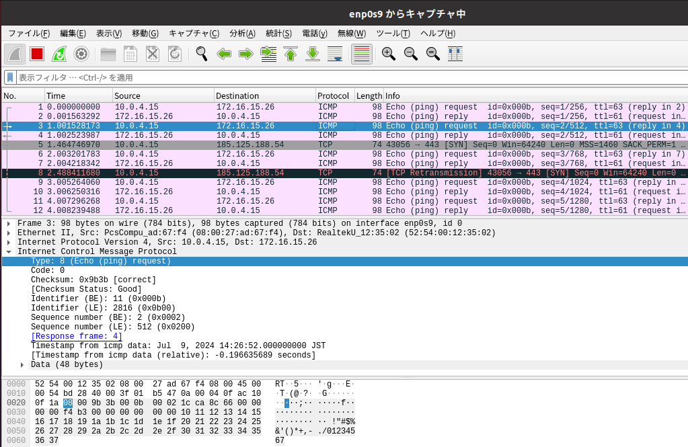

## 3I04 市川 敬士

# 1. 目的

1. インターネット層における、IPプロトコルを使ったIPルーティングについて理解し、どのようにIPパケットを伝送しているかを理解する。
2. ubuntu(Linux)の基本的なネットワーク設定について理解する。
3. Wiresharkを用いてパケットキャプチャを行い、IPパケット、MACフレームの構造について理解する。
4. NATやNAPT(IPマスカレード)の目的と用途について理解する。

# 2. ルーティング設定後、正しく動作していることを示すための方法とその結果、構築したネットワーク図1

- 構築したネットワークが正しく動作していることを表す結果

1. 192.168.10.1から192.168.20.1

2. 192.168.20.1から192.168.10.1

- 構築したネットワークの詳細を可視化せよ。PC(ホスト名)、NIC(インターフェース名、IPアドレス)、ネットワーク(IPアドレス、ネットマスク)を図示すること。  
また、各ホストのルーティングテーブルも明示すること。

1. ネットワーク図

1. ルーティングテーブル

|ネットワーク|ネクストホップ|メトリック|
|:---|:---|:---|
|192.168.10.0/24|192.168.100.10|1|
|192.168.20.0/24|直接接続|0|
|192.168.100.0/24|直接接続|0|

# 3. NAT, NAPT設定後、正しく動作していることを示すための方法とその結果、構築したネットワーク図2

- 構築したネットワークが正しく動作していることを表す結果。

- 構築したネットワークの詳細を可視化せよ。PC(ホスト名)、NIC(インターフェース名、IPアドレス), ネットワーク(IPアドレス、ネットマスク)、NATを図示すること。  
また、各ホストのルーティングテーブルもルーティングテーブルも明示すること。

- ルーティングテーブル

|ネットワーク|ネクストホップ|メトリック|
|:---|:---|:---|
|10.0.4.0/24|直接接続|0|
|192.168.10.0/24|192.168.100.10|1|
|192.168.20.0/24|直接接続|0|
|192.168.100.0/24|直接接続|0|

# 4. ICMPパケット一つ(往復分)の構造

- スクリーンショット二枚の青い部分はICMPパケット分の情報を示している。

## 構造について

- 例えば上の2枚のスクリーンショットで`type`という部分にカーソルを合わせるとその部分を青色で表示されるようになっている。それを参照に構造についてまとめる。

- 前から順にtype、code、checksum、identifer(BE)、sequence number(BE)、データ部に分かれている。

- 構造は以下のようになっている

|名称|データ量|今回の値|
|:---|:---|:---|
|type|1byte|0x08|
|code|1byte|0x00|
|checksum|2byte|0xd229|
|identifer|2byte|16|
|sequence number|2byte|1|
|データ部|可変長(今回は48byte)|(省略)|

# 5. 外部へのICMPパケットをキャプチャする。到達先のIPアドレスによる違いとexp1-2での処理

- キャプチャするNICの位置によって、ICMPパケット(IPフレーム)の内容がどのように変わっているか確認し、ex1-2で何が行われているか(実験1でex1-2に対してどのような設定を行ったのかを考えて)考察する。

- enp0s8のICMPパケット

- enp0s9のICMPパケット

- ex1-1から1-2に送る際にはex1-1から1-2に送るようにしているが、1-2を介すと1-1から外部ネットワークにというものではなく1-2から外部ネットワークに接続するようになっている。

- このことからex1-2では送信元を1-1から1-2に変換することで、外部ネットワークに1-1のアドレスを漏らさないようにしていると考えられる。

# 6. 今回の実験で理解したこと、理解できていないこと

- NATは外部のネットワークに接続するために別の存在を介することで外部に自分の情報を漏らさないようにしているということ。

- 今回の実験の発展のフィルタリング機能のようにすることで子供のスマホやゲームの機器が外部ネットワークに接続することを拒否させているのだと感じた。

# 発展

- exp1-1からコマンドラインでWebページへアクセスしたとき、上記と同様にenp0s9及びenp0s8でパケットキャプチャしたときに、TCPパケット(IPフレーム)がどのように変わっているかを確認し、exp1-2で何が行われているか考察せよ。

- enp0s8

- enp0s9

- 送信元が`192.168.100.0`から`10.0.4.15`に変更されている。また、応答があった時も同様に送信先が`10.0.4.15`から`192.168.100.0`変更されている。

- このようにexp1-2ではexp1-1のアドレスがwebページ側に漏れないようになっている。